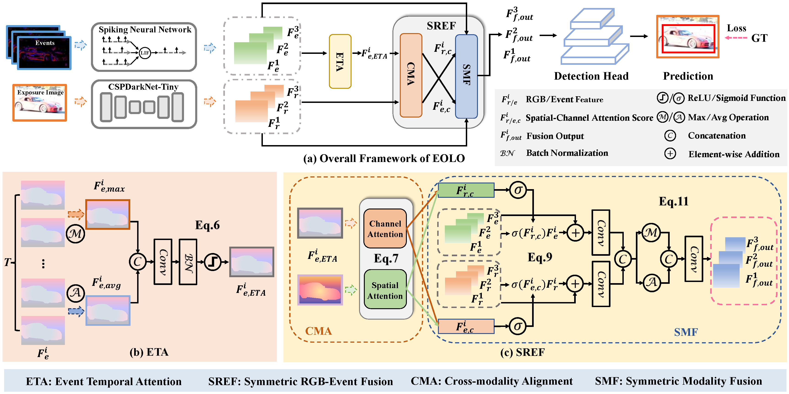
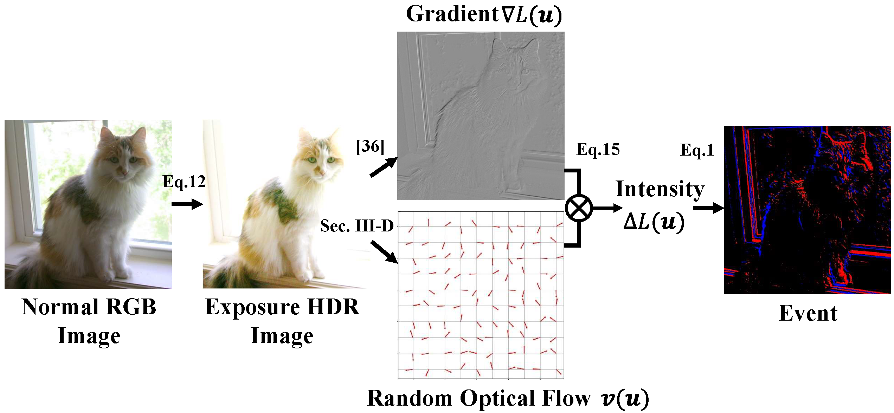

<br />
<p align="center">
  <h1 align="center">Chasing Day and Night: Towards Robust and Efficient All-Day Object Detection Guided by an Event Camera
(ICRA'24)</h1>
  <p align="center" >
    Jiahang Cao,
    Xu Zheng,
    Yuanhuiyi Lyu,
    Jiaxu Wang,
    Renjing Xu<sup>†</sup>,
    Lin Wang<sup>†</sup>
  </p>
  <p align="center" >
    <em>HKUST(GZ) & HKUST</em> 
  </p>
  <p align="center">
    <a href='https://arxiv.org/abs/2309.09297'>
      
    </a>
    <a href='https://arxiv.org/abs/2309.09297' style='padding-left: 0.5rem;'>
      
    </a>
  </p>
  <p align="center">
    
  </p>
</p>


## Requirements

1. (Optional) Creating conda environment.
```shell
conda create -n EOLO
conda activate EOLO
```

2. Installing dependencies.
```shell
git clone https://github.com/AndyCao1125/EOLO.git
cd EOLO
pip install -r requirements.txt
```

## Training & Testing
Codes for training EOLO: 

```shell
CUDA_VISIBLE_DEVICES=0 python train_eyolo.py \
     -d voc \
     --cuda \
     -m E-yolo-tiny \
     --ema \
     --num_gpu 1 \
     --batch_size 32 \
     --root path/to/dataset/\
     --lr 0.0005 \
     --img_size 320 \
     --max_epoch 50 \
     --lr_epoch 30 40 \
     --save_name EOLO-tiny_VOC_Underexposure_0.2_random42_1gpu_32bs_50epoch_SREF\
     --img_size 320\
     --data_type Exposure_Event\
     --exposure_factor Underexposure_0.2_random42\
     --fusion_method SREF\
     --use_wandb   
```


## Dataset Preparation
### Download VOC 2007 & 2012 dataset
```shell
# Please specify a directory for dataset to be downloaded into, else default is ~/data/
sh data/scripts/VOC2007.sh
sh data/scripts/VOC2012.sh
```


## Event-based Dataset Generation
</p>
<p align="center">
  
</p>

To obtain paired event data, we propose a novel event frame synthesis method that generates event frames by the randomized optical flow and luminance gradients. **Only a single RGB/HDR image is required to generate the corresponding event frames.**

You can easily generate E-VOC dataset by 

```shell
python event2frame.py
```
The resulting dataset will have the following data structure:

``` graphql
VOC2007
|---Event                      ## Raw Event (.npy)
   |---{event_type}, e.g.,'Underexposure_0.2_random42'
       |---XXXX.npy
       |...
|---EventFrameImages           ## Event Frame (.jpg)
    |---{event_type}
       |---XXXX.jpg
       |...
|---ExposureImages             ## Exposure RGB image for visulization (.jpg), clip into [0,255] from HDR image
    |---{event_type}
       |---XXXX.jpg
       |...
|---HDRImages                  ## Exposure Images (.exr)
    |---{event_type}
       |---XXXX.exr
       |...
|---Annotations                
|---JPEGImages
|---ImageSets
|---SegmentationClass
|---SegmentationObject
```
where the Event, EventFrameImages, ExposureImages and HDRImages are newly generated. Please remember, you need to first download the original VOC dataset before this step. 


## Citation

If you find our work useful, please consider citing:

```
@article{cao2023chasing,
  title={Chasing Day and Night: Towards Robust and Efficient All-Day Object Detection Guided by an Event Camera},
  author={Cao, Jiahang and Zheng, Xu and Lyu, Yuanhuiyi and Wang, Jiaxu and Xu, Renjing and Wang, Lin},
  journal={arXiv preprint arXiv:2309.09297},
  year={2023}
}
```

## Acknowledgements & Contact
We thank the authors ([PyTorch_YOLO-Family](https://github.com/yjh0410/PyTorch_YOLO-Family)) for their open-sourced codes.

For any help or issues of this project, please contact jcao248@connect.hkust-gz.edu.cn.
